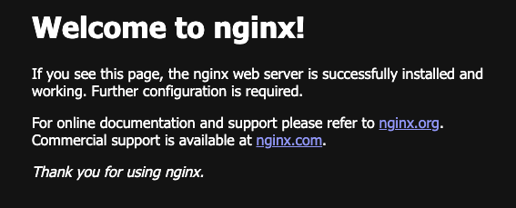

# Go Device Plugin 
Test device plugin with GoLang.

## Table of Contents


## Motivation

First experiment to understand how a device plugin works with Kubernetes. 
We will write one in GoLang. 

### What is a device plugin?

A device plugin for kubernetes is often explained that it bridges 
a hardware of all kinds to Kubernetes. A device plugin makes 
the hardware visible to a pod. 

However, 90% of the time, that hardware is a GPU, and the rest is an IoT device or 
a storage device for which  official plugins are not yet available. 

A device plugin is like a device driver for a baremetal, but does an extra
work to connect the hardware that is attached to the baremetal to Kubernetes
cluster that runs on it. 
(a device plugin for kubernetes cluster requires a device drive as a requirement)

A device plugin runs as a **Daemonset**, which is a pod that runs all the nodes
that consists of a cluster. 

A device plugin is only required to run on the node where the hardware (most of 
the time, it is a GPU) is installed.  Therefore we need ```Torelations``` or 
```nodeSelector``` so that the device plugin runs on the right node. 


### How a device plugin communicate with cluster

A device plugin works side by side with **kubelet**, and 
communicate only with kubelet. A device plugin does **not**
discuss with API server, scheduler, contoller manager or a pod.

The comnunication protocol is **gRPC**, therefore a device driver 
is usually written in **GoLang**. 

```sh

+-----------------------------+
|         kubelet             |
|   /var/lib/kubelet/device-plugins/kubelet.sock
+------------┬----------------+
             │  gRPC
             │
+------------▼----------------+
|      Device Plugin          |
|  (your daemonset pod)       |
+-----------------------------+

```

A device plugin give kubelet access to the hardware

1. device plugin first let kubelet know the list of devices (ListAndWatch)
2. kubelet will advertise to scheduler that this node has that hardware
3. scheduler will assign a pod to that node, when that pod require that hardware
4. kubelet asks device plugin to assign the hardware to the pod (Allocate)
5. device plugins let kubelet know necessary infos such as env, device mount, etc.
6. kubelet uses these infos and create a container. 


### Required methods defined in a device plugin


---
## Techstack of choice

### Kind

As my laptop is recently overhauled (the system is reinstalled 
    from the operation system up), we have a complete free hand to select the tech-stuck. As a Kubernetes backbone, I would have following options. 

    - native kubernetes with kubeadm  
    - microk8s
    - minikube
    - kind
    - k3s

This time I opt to **kind**, as my laptop is now under performant (= hardware is tool old) for the tasks it is up to.


### Container Runtime

As docker desktop is too heavy for my machine, we will go for light-weight docker desktop alternative, [Colima](https://github.com/abiosoft/colima).

### VM

Therefore we will create backbone VMs with [Lima](https://github.com/lima-vm/lima).

### Container runtime

I prefer ```containerd``` to docker, but could not use ```nerdctl``` as it does not support macOS 13 ventura.
```sh

$ brew install nerdctl
Warning: You are using macOS 13.
We (and Apple) do not provide support for this old version.
You may have better luck with MacPorts which supports older versions of macOS:
  https://www.macports.org
...
```

Moreover, containerd requires qemu, and qemu  
dose not run on macOS 13 Ventura. Therefore I have to live with docker. Sigh... 


We will draw back to ```docker```, but at least without docker desktop.


---
## Build Infrastructure

We will build the architecture in the following order.

1. Lima
2. Colima
3. docker (without 'desktop') 
4. kind
5. GoLang


Roughly speaking,

|             |                   |
|-------------|-------------------|  
| docker      | docker            |
| Colima      | ~ docker desktop  |
| lima        | ~ vagrant         | 
| qemu        | ~ virtual box     |


So, like this. 

```sh
macOS
  └── Colima VM (Linux)
        └── Docker
              └── kind node (Kubernetes)
                    └── kubelet
                          └── your device plugin

```

Colima uses qemu inside, but we do not need to install qemu separately.

Okay, then first lima,
```sh
$ brew install lima
```

Check, 

```sh
$ lima --version
limactl version 2.0.2
```

Then docker. 

```sh
$ brew install docker
```

Check. 
```sh
$ docker version
Client: Docker Engine - Community
 Version:           29.1.1
 API version:       1.52
 Go version:        go1.25.4
...
 ```


Then Colima
```sh
$ brew install colima
...
```

Check if it is installed correctly.
```sh
$ colima version
colima version 0.9.1
...
```

Start it with ```docker``` container runtime. 

```sh
$ colima start --runtime docker
INFO[0000] starting colima
INFO[0000] runtime: docker
INFO[0003] creating and starting ...                     context=vm
INFO[0004] downloading disk image ...                    context=vm
INFO[0038] provisioning ...                              context=docker
INFO[0040] starting ...                                  context=docker
INFO[0042] done
```

Then check docker.

```sh
$ docker ps
CONTAINER ID   IMAGE     COMMAND   CREATED   STATUS    PORTS     NAMES

```

Let us test if we can run nginx container on colima. 

```sh
docker run --name test-nginx -p 8080:80 -d nginx
```

Open http://localhost:8080



All right. 

Stop colima.
```sh
$ colima stop
```

Check.

```sh
$ colima status
FATA[0000] colima is not running
```

If we would like to change the runtime, we will first
```sh 
$ colima delete --data
```

and start colima again. 

---

### Kubernets

We will install **```kind```**.  kind is [not officially supported by Homebrew on macOS 13 Ventura](https://formulae.brew.sh/formula/kind), but it worked. 

```sh
$ brew install kind
```

Check 

```sh
$ kind version
kind v0.30.0 go1.25.4 darwin/amd64
```

We will need [```kubectl```](https://kubernetes.io/docs/tasks/tools/install-kubectl-macos/) as well.

```sh
$  curl -LO "https://dl.k8s.io/release/$(curl -L -s https://dl.k8s.io/release/stable.txt)/bin/darwin/amd64/kubectl"

  % Total    % Received % Xferd  Average Speed   Time    Time     Time  Current
                                 Dload  Upload   Total   Spent    Left  Speed
100   138  100   138    0     0    916      0 --:--:-- --:--:-- --:--:--   920
100 58.9M  100 58.9M    0     0  43.9M      0  0:00:01  0:00:01 --:--:-- 53.0M

$ chmod +x kubectl
$ mv kubectl /usr/local/bin/
$ rehash
$ kubectl version
Client Version: v1.34.2
Kustomize Version: v5.7.1
Error from server (NotFound): the server could not find the requested resource
```

Let us add [autocompletion](https://kubernetes.io/docs/tasks/tools/install-kubectl-macos/#enable-shell-autocompletion)
and alias in ~/.zshrc.

```sh
alias k="kubectl"
autoload -Uz compinit
compinit
source <(kubectl completion zsh)
```

Then 
```sh
$ source ~/.zshrc
```

Check if we have ```~/.kube/config```
```sh
$ ls ~/.kube/
total 16
-rw-------  1 meg  staff  5576 Dec  2 12:44 config
drwxr-x---  4 meg  staff   128 Dec  2 12:45 cache

```
Yes. 


All right. Then we will create a Kubernetes cluster. 

```sh
$ kind create cluster --name dev
Creating cluster "dev" ...
 ✓ Ensuring node image (kindest/node:v1.34.0) 🖼
 ✓ Preparing nodes 📦
 ✓ Writing configuration 📜
 ✓ Starting control-plane 🕹️
 ✓ Installing CNI 🔌
 ✓ Installing StorageClass 💾
Set kubectl context to "kind-dev"
You can now use your cluster with:

kubectl cluster-info --context kind-dev

Thanks for using kind! 😊
```

Then test the cluster.

```sh
$ kubectl cluster-info --context kind-dev
Kubernetes control plane is running at https://127.0.0.1:62692
CoreDNS is running at https://127.0.0.1:62692/api/v1/namespaces/kube-system/services/kube-dns:dns/proxy

To further debug and diagnose cluster problems, use 'kubectl cluster-info dump'.
```

All right. 
```sh
$ k get no
NAME                STATUS   ROLES           AGE     VERSION
dev-control-plane   Ready    control-plane   8m41s   v1.34.0
```


Can we see the node on docker?
```sh
$ docker ps
CONTAINER ID   IMAGE                  COMMAND                  CREATED       STATUS       PORTS                       NAMES
f539cb220062   kindest/node:v1.34.0   "/usr/local/bin/entr…"   6 hours ago   Up 6 hours   127.0.0.1:62692->6443/tcp   dev-control-plane
```

Wunderbar.


----
## Directory Structure

Go dose not have framework tools. Just create directories one by one. 


```sh


$ mkdir -p ./cmd/device-plugin
$ mkdir -p ./pkg/plugin
$ mkdir -p ./deployments

$ touch ./cmd/device-plugin/main.go   
...

```

Currently it looks like this.
```sh
$ tree .
.
├── GO_DEVICE_PLUGIN
├── LICENSE
├── README.md
├── cmd
│   └── device-plugin
│       └── main.go
├── deployments
│   ├── device-plugin-daemonset.yaml
│   └── test-pod.yaml
├── go.mod
├── go.sum
└── pkg
    └── plugin
        └── plugin.go
```

|              |                         |
|--------------|-------------------------|
|```go.mod``` |                           |
|```go.sum```  |                          |


---
## Source Code 

Write 

- ./cmd/device-plugin/main.go
- ./pkg/plugin/plugin.go

## Go Package

At the project root, 

```sh
$ go get google.golang.org/grpc@v1.71.3
```

Pick one that is comparable with go 1.22


```sh
$ go get k8s.io/kubelet@v0.34.0
go: downloading k8s.io/kubelet v0.34.0
go: added k8s.io/kubelet v0.34.0
```
https://pkg.go.dev/k8s.io/kubelet 
(latest version)

https://pkg.go.dev/google.golang.org/grpc


brew uninstall go
brew install go@1.24


go mod tidy
env GOOS=linux GOARCH=amd64 go build -o device-plugin ./cmd/device-plugin


GOOS=linux GOARCH=amd64 go build -o device-plugin ./cmd/device-plugin


docker cp ./device-plugin dev-control-plane:/device-plugin
Successfully copied 15.5MB to dev-control-plane:/device-plugin

----
# END
----